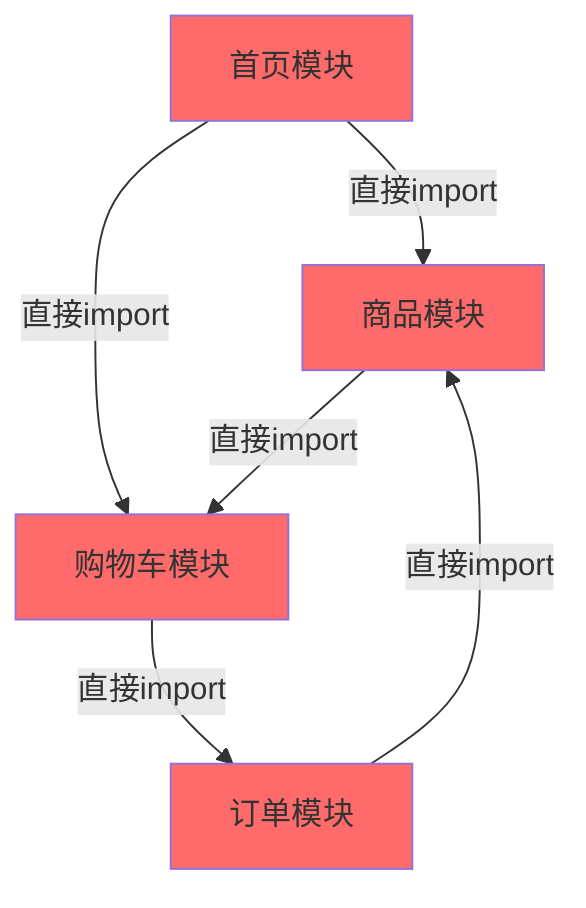
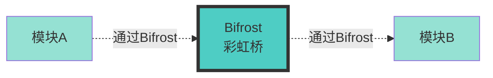
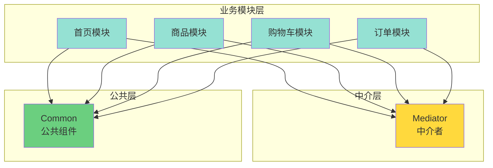
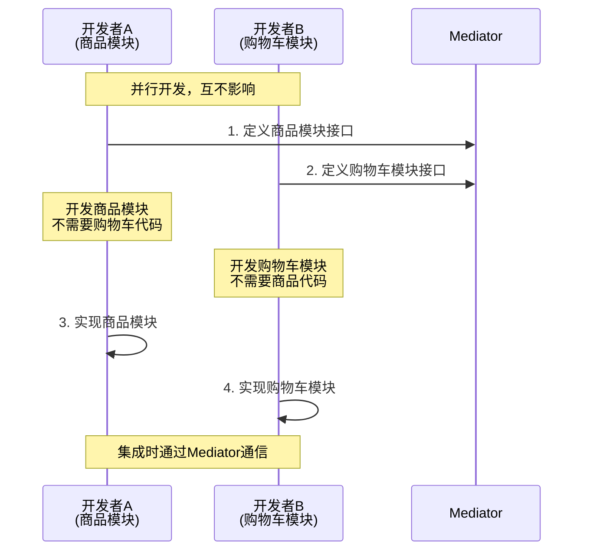
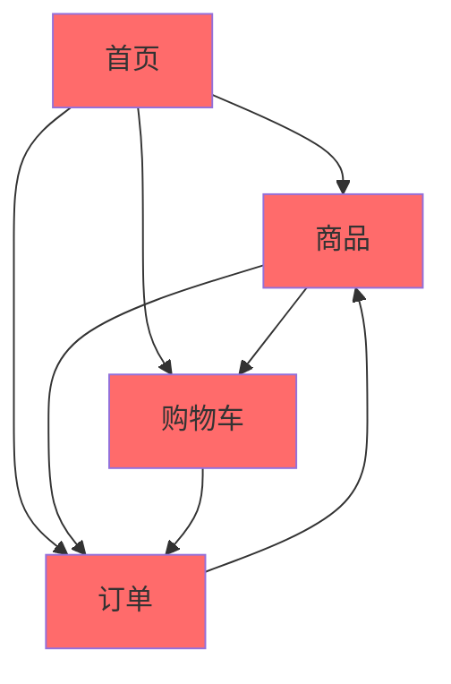
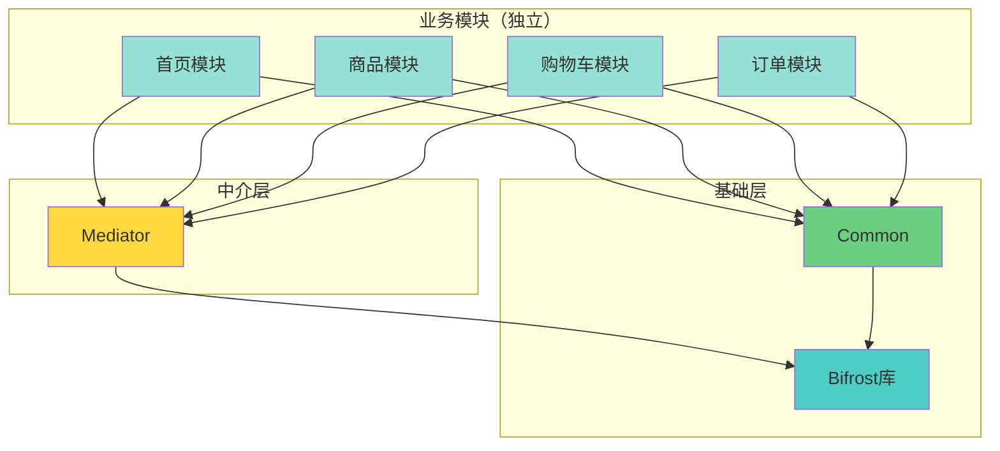

# 01 - 什么是Bifrost？

## 📖 目录
- [背景：iOS应用的模块化困境](#背景ios应用的模块化困境)
- [Bifrost是什么](#bifrost是什么)
- [Bifrost解决了什么问题](#bifrost解决了什么问题)
- [传统架构 vs Bifrost架构](#传统架构-vs-bifrost架构)
- [适用场景](#适用场景)

---

## 背景：iOS应用的模块化困境

### 问题场景

想象你正在开发一个电商App，随着业务发展，App变得越来越复杂：

- **首页模块**：展示商品推荐、活动banner
- **商品模块**：商品详情、商品列表
- **购物车模块**：管理购物车、结算
- **订单模块**：订单列表、订单详情

### 传统开发方式的问题

在传统的iOS开发中，模块之间通常是这样相互调用的：



**这会导致什么问题？**

1. **代码耦合严重**
   - 首页模块要使用商品详情，必须 `#import "GoodsDetailViewController.h"`
   - 一旦商品模块的代码出错，首页模块也无法编译

2. **循环依赖**
   - 商品模块需要跳转到购物车
   - 购物车需要显示商品信息
   - 形成循环依赖，导致编译困难

3. **团队协作困难**
   - 张三负责商品模块，李四负责购物车模块
   - 李四的代码依赖张三的代码，张三还没写完，李四就无法编译测试

4. **无法独立开发**
   - 想单独测试购物车模块？不行，必须把所有依赖的模块都编译进来

---

## Bifrost是什么

**Bifrost** 是一个iOS业务模块化架构库（Business Modular Architecture Library）。

### 名字的由来

Bifrost（彩虹桥）来自北欧神话和漫威电影《雷神》：
- 在神话中，Bifrost是连接人间和神界的彩虹桥
- 人们可以通过这座桥瞬间到达任何地方
- 在我们的架构中，Bifrost让模块之间可以"瞬间通信"，而不需要直接依赖



### 核心理念

**解耦业务模块之间的代码依赖，但保留业务依赖**

- ❌ **代码依赖**：A模块的代码必须import B模块的头文件才能编译
- ✅ **业务依赖**：A模块的业务逻辑需要B模块提供的功能

Bifrost的目标是：**消除代码依赖，保留业务依赖**

---

## Bifrost解决了什么问题

### 1. 消除模块间的代码依赖

使用Bifrost后，模块之间不再直接import：



**关键点：**
- 业务模块之间没有任何箭头连接（没有代码依赖）
- 所有模块只依赖Mediator和Common
- 模块可以独立编译和测试

### 2. 支持独立开发和测试



### 3. 提供两种通信方式

Bifrost提供两种模块间通信方式：

#### 方式1：Router URL（路由URL）
适用于页面跳转和简单参数传递

```objective-c
// 跳转到商品详情页
NSString *url = @"//goods/detail?id=12345";
UIViewController *vc = [Bifrost handleURL:url];
[self.navigationController pushViewController:vc animated:YES];
```

#### 方式2：Remote API（远程API）
适用于复杂数据交互和方法调用

```objective-c
// 获取商品信息
id<GoodsProtocol> goods = [BFModule(GoodsModuleService) goodsById:@"12345"];
NSLog(@"商品名称：%@", goods.name);
```

---

## 传统架构 vs Bifrost架构

### 传统架构：网状依赖



**问题：**
- 🔴 模块间相互依赖，形成网状结构
- 🔴 一个模块出错，影响其他模块编译
- 🔴 无法独立开发和测试
- 🔴 代码修改影响范围大

### Bifrost架构：星型依赖



**优势：**
- ✅ 业务模块完全解耦，可独立编译
- ✅ 通过Mediator定义清晰的模块接口
- ✅ 支持并行开发，提高团队效率
- ✅ 模块可插拔，易于维护和扩展

---

## 适用场景

### ✅ 适合使用Bifrost的项目

1. **中大型iOS应用**
   - 业务模块较多（3个以上）
   - 团队规模较大（3人以上）
   - 需要长期维护和迭代

2. **业务领域相对稳定**
   - 可以清晰划分业务模块（如：首页、商品、订单、用户等）
   - 模块边界不会频繁变化

3. **多团队协作**
   - 不同团队负责不同模块
   - 需要并行开发，减少相互等待

### ❌ 不适合使用Bifrost的项目

1. **小型应用**
   - 功能简单，模块少（1-2个）
   - 引入Bifrost反而增加复杂度

2. **业务频繁变化**
   - 模块边界不清晰
   - 业务逻辑经常重构

3. **单人开发**
   - 没有团队协作需求
   - 模块化收益不明显

---

## 下一步

现在你已经了解了Bifrost是什么以及它解决的问题。

在下一章节中，我们将深入学习Bifrost的核心概念：
- 什么是业务模块 vs 功能模块
- 什么是代码依赖 vs 业务依赖
- Bifrost的三层架构详解

👉 [下一章：核心概念](./02-核心概念.md)
