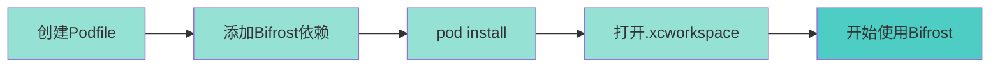
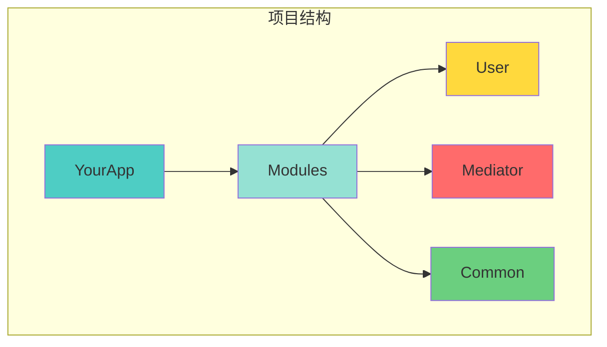
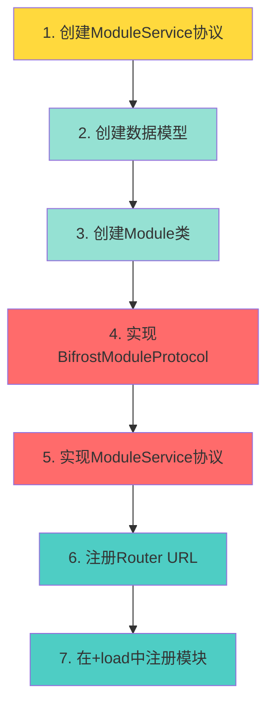
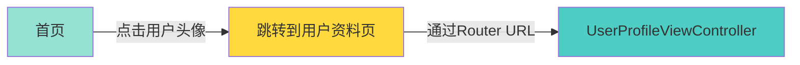
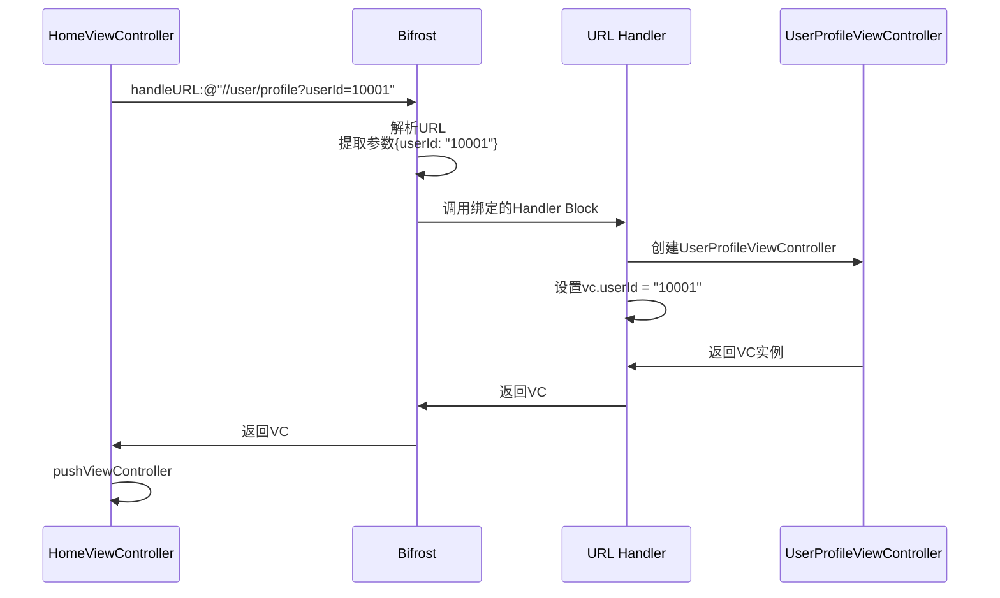
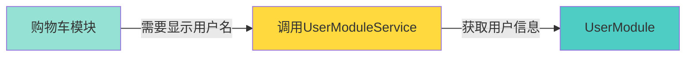
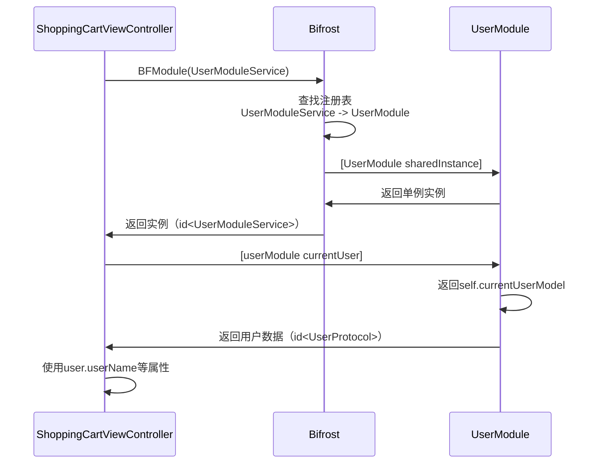
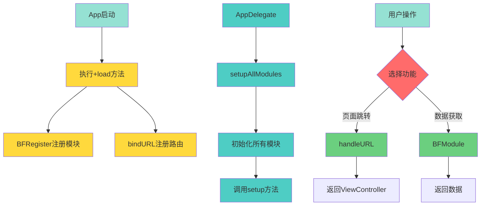

# 03 - 快速开始

## 📖 目录
- [环境准备](#环境准备)
- [安装Bifrost](#安装bifrost)
- [创建第一个模块](#创建第一个模块)
- [实现Router URL](#实现router-url)
- [实现Remote API](#实现remote-api)
- [完整示例](#完整示例)

---

## 环境准备

### 系统要求

- macOS 10.12+
- Xcode 9.0+
- iOS 7.0+
- CocoaPods 1.0+

### 检查CocoaPods

```bash
# 检查CocoaPods是否已安装
pod --version

# 如果未安装，执行以下命令安装
sudo gem install cocoapods
```

---

## 安装Bifrost

### 步骤1：创建Podfile

在你的项目根目录创建`Podfile`文件：

```bash
cd YourProject
pod init
```

### 步骤2：添加Bifrost依赖

编辑`Podfile`，添加Bifrost：

```ruby
platform :ios, '8.0'

target 'YourApp' do
  use_frameworks!  # 如果使用Swift

  # 添加Bifrost
  pod 'Bifrost'

end
```

### 步骤3：安装依赖

```bash
pod install
```

### 步骤4：打开工作空间

```bash
# 注意：安装后必须使用.xcworkspace文件，不要使用.xcodeproj
open YourApp.xcworkspace
```

### 安装流程图



---

## 创建第一个模块

我们将创建一个简单的"用户模块"（User Module），演示Bifrost的基本用法。

### 项目结构规划



### 步骤1：创建Mediator模块

Mediator模块用于存放所有模块的服务协议。

#### 1.1 在Xcode中创建Mediator文件夹

```
YourApp/
└── Modules/
    └── Mediator/
        └── ModuleService/
            └── UserModuleService.h
```

#### 1.2 创建UserModuleService.h

```objective-c
//
//  UserModuleService.h
//  Mediator
//
//  定义用户模块对外提供的服务
//

#ifndef UserModuleService_h
#define UserModuleService_h

#import <BifrostHeader.h>

NS_ASSUME_NONNULL_BEGIN

///<v1.0>

#pragma mark - URL routers
// 定义路由URL常量
static NSString *const kRouteUserProfile = @"//user/profile";
static NSString *const kRouteUserProfileParamUserId = @"userId";

#pragma mark - Model Protocols
// 定义用户数据模型协议
@protocol UserProtocol <NSObject>
- (NSString*)userId;
- (NSString*)userName;
- (NSString*)avatar;
@end

#pragma mark - Module Protocol
// 定义用户模块服务协议
@protocol UserModuleService <NSObject>

/// 获取当前登录用户
- (id<UserProtocol> _Nullable)currentUser;

/// 根据用户ID获取用户信息
- (id<UserProtocol> _Nullable)userById:(NSString*)userId;

/// 用户是否已登录
- (BOOL)isUserLoggedIn;

@end

NS_ASSUME_NONNULL_END

#endif /* UserModuleService_h */
```

<thinking>
我需要继续创建用户模块的实现部分。让我继续编写文档，包括：
1. 创建User模块的实现
2. 实现UserModule类
3. 实现UserModel类
4. 注册模块
5. 在AppDelegate中初始化

然后我需要展示如何使用Router URL和Remote API。
</thinking>

### 步骤2：创建User模块实现

#### 2.1 创建User模块文件夹结构

```
YourApp/
└── Modules/
    └── User/
        ├── Module/
        │   ├── UserModule.h
        │   └── UserModule.m
        ├── Model/
        │   ├── UserModel.h
        │   └── UserModel.m
        └── Controller/
            ├── UserProfileViewController.h
            └── UserProfileViewController.m
```

#### 2.2 创建UserModel（数据模型）

**UserModel.h**
```objective-c
//
//  UserModel.h
//  User
//
//  用户数据模型
//

#import <Foundation/Foundation.h>
#import "UserModuleService.h"  // 导入协议

@interface UserModel : NSObject <UserProtocol>

@property (nonatomic, copy) NSString *userId;
@property (nonatomic, copy) NSString *userName;
@property (nonatomic, copy) NSString *avatar;

@end
```

**UserModel.m**
```objective-c
//
//  UserModel.m
//  User
//

#import "UserModel.h"

@implementation UserModel

// UserProtocol协议方法已经通过@property自动实现

@end
```

#### 2.3 创建UserModule（模块入口）

**UserModule.h**
```objective-c
//
//  UserModule.h
//  User
//
//  用户模块入口
//

#import <Foundation/Foundation.h>
#import <BifrostHeader.h>
#import "UserModuleService.h"

@interface UserModule : NSObject <BifrostModuleProtocol, UserModuleService>

@end
```

**UserModule.m**
```objective-c
//
//  UserModule.m
//  User
//

#import "UserModule.h"
#import "UserModel.h"
#import "UserProfileViewController.h"

@interface UserModule ()
@property (nonatomic, strong) UserModel *currentUserModel;
@end

@implementation UserModule

#pragma mark - 模块注册

+ (void)load {
    // 在+load方法中注册模块
    BFRegister(UserModuleService);

    // 注册Router URL
    [self registerRouterURLs];
}

+ (void)registerRouterURLs {
    // 注册用户资料页面路由
    [Bifrost bindURL:kRouteUserProfile toHandler:^id _Nullable(NSDictionary * _Nullable parameters) {
        // 从URL参数中获取userId
        NSString *userId = parameters[kRouteUserProfileParamUserId];

        // 创建用户资料页面
        UserProfileViewController *vc = [[UserProfileViewController alloc] init];
        vc.userId = userId;

        return vc;
    }];
}

#pragma mark - BifrostModuleProtocol

+ (instancetype)sharedInstance {
    static UserModule *instance = nil;
    static dispatch_once_t onceToken;
    dispatch_once(&onceToken, ^{
        instance = [[self alloc] init];
    });
    return instance;
}

- (void)setup {
    NSLog(@"[UserModule] 模块初始化");

    // 模拟加载当前用户数据
    self.currentUserModel = [[UserModel alloc] init];
    self.currentUserModel.userId = @"10001";
    self.currentUserModel.userName = @"张三";
    self.currentUserModel.avatar = @"https://example.com/avatar.jpg";
}

+ (NSUInteger)priority {
    return 200;  // 用户模块优先级较高
}

#pragma mark - UserModuleService

- (id<UserProtocol>)currentUser {
    return self.currentUserModel;
}

- (id<UserProtocol>)userById:(NSString *)userId {
    // 模拟根据ID获取用户
    UserModel *user = [[UserModel alloc] init];
    user.userId = userId;
    user.userName = [NSString stringWithFormat:@"用户_%@", userId];
    user.avatar = @"https://example.com/avatar.jpg";
    return user;
}

- (BOOL)isUserLoggedIn {
    return self.currentUserModel != nil;
}

@end
```

#### 2.4 创建UserProfileViewController（用户资料页面）

**UserProfileViewController.h**
```objective-c
//
//  UserProfileViewController.h
//  User
//

#import <UIKit/UIKit.h>

@interface UserProfileViewController : UIViewController

@property (nonatomic, copy) NSString *userId;

@end
```

**UserProfileViewController.m**
```objective-c
//
//  UserProfileViewController.m
//  User
//

#import "UserProfileViewController.h"
#import "UserModuleService.h"
#import <BifrostHeader.h>

@implementation UserProfileViewController

- (void)viewDidLoad {
    [super viewDidLoad];

    self.view.backgroundColor = [UIColor whiteColor];
    self.title = @"用户资料";

    // 通过Remote API获取用户信息
    id<UserProtocol> user = [BFModule(UserModuleService) userById:self.userId];

    // 显示用户信息
    UILabel *label = [[UILabel alloc] initWithFrame:CGRectMake(20, 100, 300, 100)];
    label.numberOfLines = 0;
    label.text = [NSString stringWithFormat:@"用户ID: %@\n用户名: %@",
                  user.userId, user.userName];
    [self.view addSubview:label];
}

@end
```

### 模块创建流程图



---

## 实现Router URL

Router URL用于页面跳转和简单参数传递。

### 使用场景



### 步骤1：定义Router URL常量

在`UserModuleService.h`中定义：

```objective-c
#pragma mark - URL routers
static NSString *const kRouteUserProfile = @"//user/profile";
static NSString *const kRouteUserProfileParamUserId = @"userId";
```

### 步骤2：绑定URL Handler

在`UserModule.m`的`+load`方法中绑定：

```objective-c
+ (void)registerRouterURLs {
    [Bifrost bindURL:kRouteUserProfile toHandler:^id _Nullable(NSDictionary * _Nullable parameters) {
        // 1. 从参数中获取userId
        NSString *userId = parameters[kRouteUserProfileParamUserId];

        // 2. 创建ViewController
        UserProfileViewController *vc = [[UserProfileViewController alloc] init];
        vc.userId = userId;

        // 3. 返回ViewController
        return vc;
    }];
}
```

### 步骤3：调用Router URL

在其他模块中使用：

```objective-c
// 在HomeViewController.m中

#import "UserModuleService.h"  // 导入协议，获取URL常量

- (void)showUserProfile {
    // 方式1：使用URL常量（推荐）
    NSString *url = [NSString stringWithFormat:@"%@?%@=%@",
                     kRouteUserProfile,
                     kRouteUserProfileParamUserId,
                     @"10001"];

    // 方式2：使用BFStr宏（更简洁）
    NSString *url = BFStr(@"%@?%@=%@",
                          kRouteUserProfile,
                          kRouteUserProfileParamUserId,
                          @"10001");

    // 调用Bifrost处理URL
    UIViewController *vc = [Bifrost handleURL:url];

    // 跳转页面
    if (vc) {
        [self.navigationController pushViewController:vc animated:YES];
    }
}
```

### Router URL工作流程



---

## 实现Remote API

Remote API用于模块间的数据交互和方法调用。

### 使用场景



### 步骤1：定义Service协议

在`UserModuleService.h`中定义：

```objective-c
#pragma mark - Module Protocol
@protocol UserModuleService <NSObject>

- (id<UserProtocol>)currentUser;
- (id<UserProtocol>)userById:(NSString*)userId;
- (BOOL)isUserLoggedIn;

@end
```

### 步骤2：实现Service协议

在`UserModule.m`中实现：

```objective-c
#pragma mark - UserModuleService

- (id<UserProtocol>)currentUser {
    return self.currentUserModel;
}

- (id<UserProtocol>)userById:(NSString *)userId {
    UserModel *user = [[UserModel alloc] init];
    user.userId = userId;
    user.userName = [NSString stringWithFormat:@"用户_%@", userId];
    return user;
}

- (BOOL)isUserLoggedIn {
    return self.currentUserModel != nil;
}
```

### 步骤3：调用Remote API

在其他模块中使用：

```objective-c
// 在ShoppingCartViewController.m中

#import "UserModuleService.h"  // 导入协议

- (void)showUserInfo {
    // 1. 获取用户模块实例
    id<UserModuleService> userModule = BFModule(UserModuleService);

    // 2. 检查用户是否登录
    if ([userModule isUserLoggedIn]) {
        // 3. 获取当前用户信息
        id<UserProtocol> user = [userModule currentUser];

        // 4. 使用用户信息
        NSLog(@"当前用户：%@", user.userName);
        self.userNameLabel.text = user.userName;
    } else {
        NSLog(@"用户未登录");
    }
}

- (void)loadUserById:(NSString*)userId {
    // 根据ID获取用户信息
    id<UserProtocol> user = [BFModule(UserModuleService) userById:userId];
    NSLog(@"用户名：%@", user.userName);
}
```

### Remote API工作流程



---

## 完整示例

### 在AppDelegate中初始化

```objective-c
//
//  AppDelegate.m
//

#import "AppDelegate.h"
#import <BifrostHeader.h>

@implementation AppDelegate

- (BOOL)application:(UIApplication *)application
    willFinishLaunchingWithOptions:(NSDictionary *)launchOptions {

    // 初始化所有已注册的模块
    [Bifrost setupAllModules];

    return YES;
}

- (BOOL)application:(UIApplication *)application
    didFinishLaunchingWithOptions:(NSDictionary *)launchOptions {

    // 创建窗口
    self.window = [[UIWindow alloc] initWithFrame:[UIScreen mainScreen].bounds];

    // 创建首页
    UIViewController *homeVC = [[UIViewController alloc] init];
    homeVC.view.backgroundColor = [UIColor whiteColor];
    homeVC.title = @"首页";

    // 添加测试按钮
    [self addTestButtonsToViewController:homeVC];

    // 设置导航控制器
    UINavigationController *nav = [[UINavigationController alloc] initWithRootViewController:homeVC];
    self.window.rootViewController = nav;

    [self.window makeKeyAndVisible];

    return YES;
}

- (void)addTestButtonsToViewController:(UIViewController*)vc {
    // 测试Router URL按钮
    UIButton *routerButton = [UIButton buttonWithType:UIButtonTypeSystem];
    routerButton.frame = CGRectMake(50, 150, 300, 50);
    [routerButton setTitle:@"测试Router URL跳转" forState:UIControlStateNormal];
    [routerButton addTarget:self
                     action:@selector(testRouterURL)
           forControlEvents:UIControlEventTouchUpInside];
    [vc.view addSubview:routerButton];

    // 测试Remote API按钮
    UIButton *apiButton = [UIButton buttonWithType:UIButtonTypeSystem];
    apiButton.frame = CGRectMake(50, 220, 300, 50);
    [apiButton setTitle:@"测试Remote API" forState:UIControlStateNormal];
    [apiButton addTarget:self
                  action:@selector(testRemoteAPI)
        forControlEvents:UIControlEventTouchUpInside];
    [vc.view addSubview:apiButton];
}

- (void)testRouterURL {
    NSLog(@"=== 测试Router URL ===");

    // 使用Router URL跳转到用户资料页
    NSString *url = BFStr(@"%@?%@=%@",
                          kRouteUserProfile,
                          kRouteUserProfileParamUserId,
                          @"10001");

    UIViewController *vc = [Bifrost handleURL:url];

    if (vc) {
        UINavigationController *nav = (UINavigationController*)self.window.rootViewController;
        [nav pushViewController:vc animated:YES];
        NSLog(@"✅ Router URL跳转成功");
    } else {
        NSLog(@"❌ Router URL跳转失败");
    }
}

- (void)testRemoteAPI {
    NSLog(@"=== 测试Remote API ===");

    // 获取用户模块
    id<UserModuleService> userModule = BFModule(UserModuleService);

    // 测试1：检查登录状态
    BOOL isLoggedIn = [userModule isUserLoggedIn];
    NSLog(@"用户登录状态: %@", isLoggedIn ? @"已登录" : @"未登录");

    // 测试2：获取当前用户
    id<UserProtocol> currentUser = [userModule currentUser];
    NSLog(@"当前用户: ID=%@, 名称=%@", currentUser.userId, currentUser.userName);

    // 测试3：根据ID获取用户
    id<UserProtocol> user = [userModule userById:@"20002"];
    NSLog(@"查询用户: ID=%@, 名称=%@", user.userId, user.userName);

    // 显示提示
    UIAlertController *alert = [UIAlertController alertControllerWithTitle:@"测试完成"
                                                                   message:@"请查看控制台输出"
                                                            preferredStyle:UIAlertControllerStyleAlert];
    [alert addAction:[UIAlertAction actionWithTitle:@"确定"
                                              style:UIAlertActionStyleDefault
                                            handler:nil]];

    UINavigationController *nav = (UINavigationController*)self.window.rootViewController;
    [nav.topViewController presentViewController:alert animated:YES completion:nil];
}

@end
```

### 完整流程图



---

## 运行和测试

### 1. 编译项目

在Xcode中按`Cmd+B`编译项目，确保没有错误。

### 2. 运行项目

按`Cmd+R`运行项目。

### 3. 测试功能

- 点击"测试Router URL跳转"按钮，应该跳转到用户资料页
- 点击"测试Remote API"按钮，查看控制台输出用户信息

### 预期输出

```
[UserModule] 模块初始化
=== 测试Remote API ===
用户登录状态: 已登录
当前用户: ID=10001, 名称=张三
查询用户: ID=20002, 名称=用户_20002
```

---

## 常见问题

### Q1: 编译错误：找不到BifrostHeader.h

**原因：** 没有正确安装Bifrost或没有使用.xcworkspace文件

**解决：**
```bash
pod install
open YourApp.xcworkspace  # 必须打开.xcworkspace
```

### Q2: Router URL返回nil

**原因：** URL没有正确注册或URL格式错误

**解决：**
1. 检查`+load`方法中是否调用了`bindURL`
2. 检查URL格式是否正确（如：`//user/profile`）
3. 在`bindURL`的handler中添加断点，检查是否被调用

### Q3: BFModule返回nil

**原因：** 模块没有正确注册

**解决：**
1. 检查`+load`方法中是否调用了`BFRegister`
2. 检查`AppDelegate`中是否调用了`[Bifrost setupAllModules]`
3. 检查模块类是否实现了`BifrostModuleProtocol`

---

## 小结

恭喜！你已经完成了第一个Bifrost模块的开发。

本章你学会了：

1. ✅ 安装Bifrost
2. ✅ 创建ModuleService协议
3. ✅ 实现Module类
4. ✅ 注册Router URL
5. ✅ 实现Remote API
6. ✅ 在AppDelegate中初始化

---

## 下一步

现在你已经掌握了Bifrost的基本用法。

在下一章节中，我们将深入学习Router URL系统：
- URL参数传递
- 复杂参数传递
- Completion回调
- URL拦截和处理

👉 [下一章：路由系统详解](./04-路由系统详解.md)
