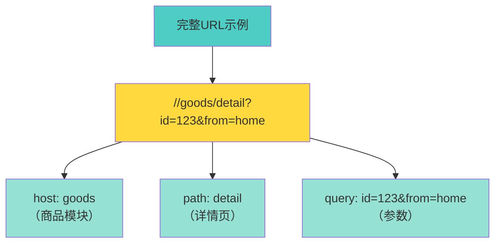
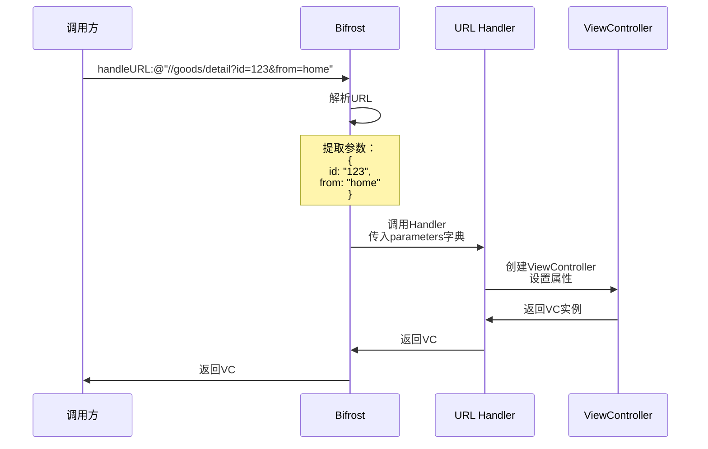
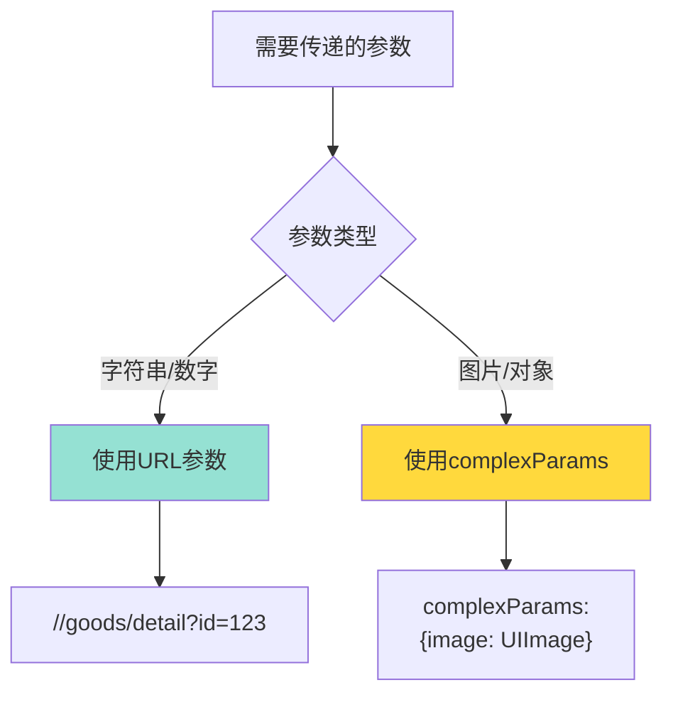
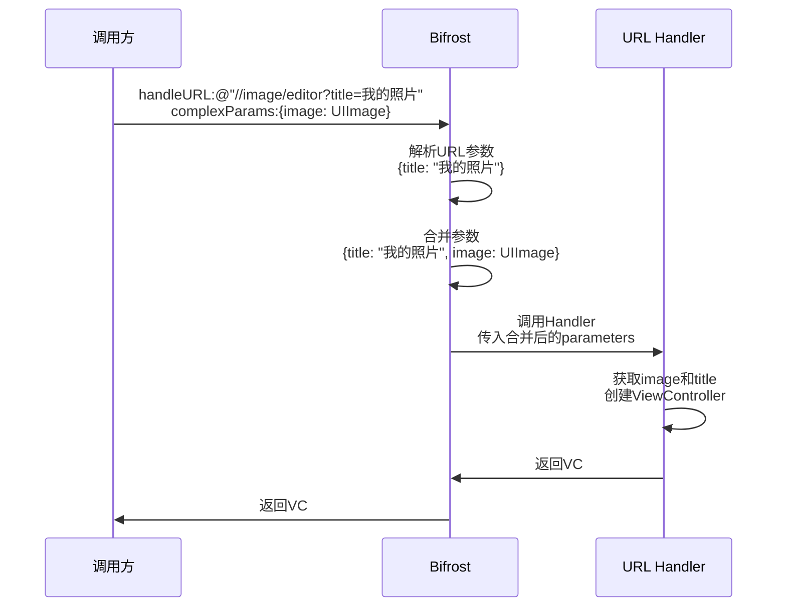
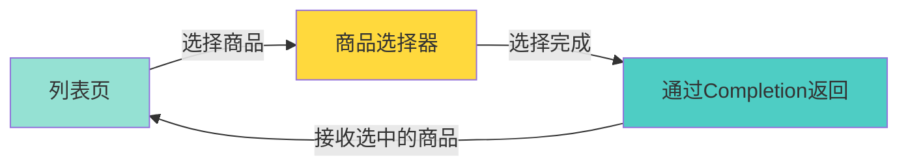
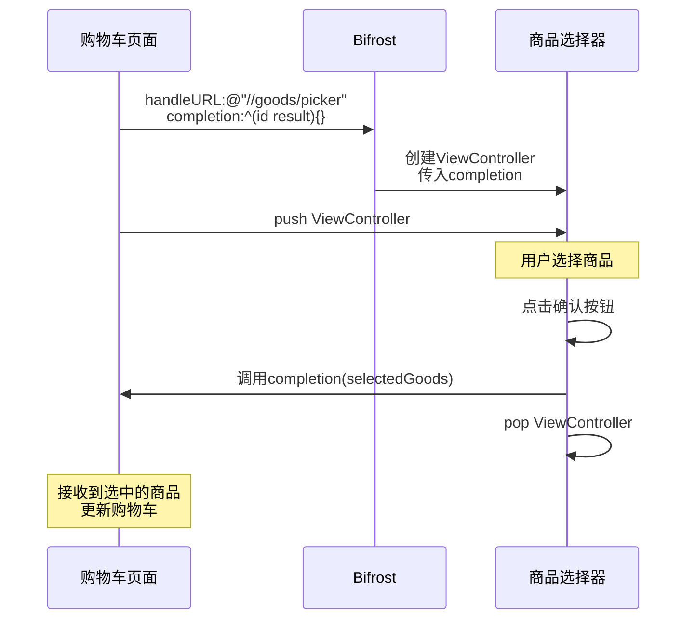
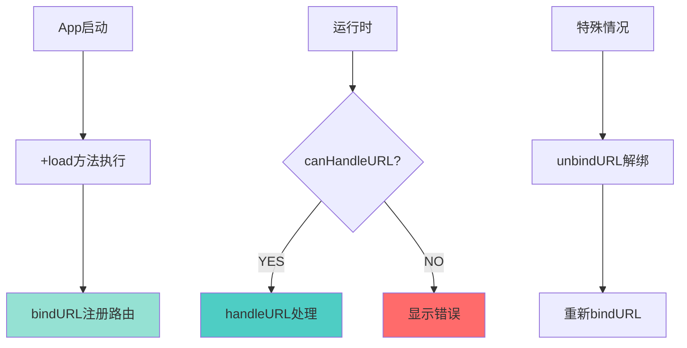
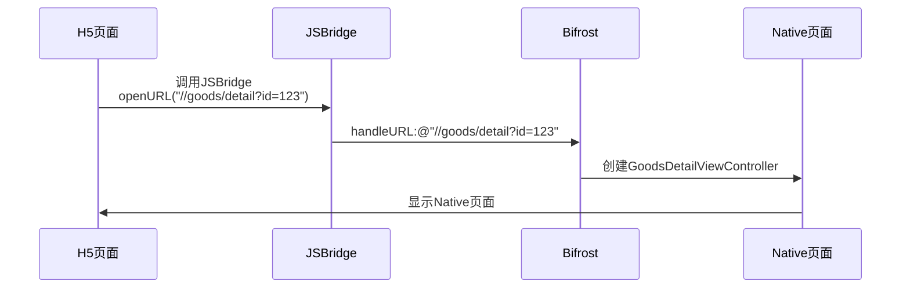

# 04 - 路由系统详解

## 📖 目录
- [Router URL概述](#router-url概述)
- [URL格式和结构](#url格式和结构)
- [简单参数传递](#简单参数传递)
- [复杂参数传递](#复杂参数传递)
- [Completion回调](#completion回调)
- [URL管理](#url管理)
- [实际应用场景](#实际应用场景)

---

## Router URL概述

Router URL是Bifrost提供的第一种模块间通信方式，主要用于页面跳转和参数传递。

### 为什么需要Router URL？

```mermaid
graph LR
    subgraph "传统方式"
        A1[模块A] -->|#import ViewController.h| B1[模块B]
    end

    subgraph "Router URL方式"
        A2[模块A] -->|handleURL:@"//b/page"| R[Bifrost]
        R -->|返回ViewController| A2
    end

    style A1 fill:#ff6b6b
    style B1 fill:#ff6b6b
    style A2 fill:#95e1d3
    style R fill:#4ecdc4
```

**优势：**
- ✅ 模块间解耦，不需要import其他模块的ViewController
- ✅ 支持跨平台（H5、Android可以使用相同的URL）
- ✅ 统一的页面跳转入口，便于管理和监控
- ✅ 支持动态路由和URL拦截

---

## URL格式和结构

### 标准URL格式

Bifrost使用类似HTTP URL的格式：

```
scheme://host/path?param1=value1&param2=value2
```

**在Bifrost中：**
- **scheme**: 通常省略或使用`//`
- **host**: 模块名称（如：goods、user、order）
- **path**: 功能路径（如：detail、list、profile）
- **query**: 参数（如：id=123&from=home）

### URL示例



### URL命名规范

**推荐格式：**
```objective-c
// 格式：//模块名/功能名
static NSString *const kRouteGoodsDetail = @"//goods/detail";
static NSString *const kRouteGoodsList = @"//goods/list";
static NSString *const kRouteUserProfile = @"//user/profile";
static NSString *const kRouteOrderDetail = @"//order/detail";
```

**命名建议：**
- 使用小写字母
- 使用`/`分隔层级
- 保持简洁明了
- 避免使用特殊字符

---

## 简单参数传递

简单参数通过URL的query string传递，适用于字符串、数字等基本类型。

### 参数传递流程



### 步骤1：定义URL和参数常量

在`GoodsModuleService.h`中定义：

```objective-c
#pragma mark - URL routers

// URL常量
static NSString *const kRouteGoodsDetail = @"//goods/detail";

// 参数key常量
static NSString *const kRouteGoodsDetailParamId = @"id";
static NSString *const kRouteGoodsDetailParamFrom = @"from";
```

<thinking>
我需要继续编写这个文档，包括：
1. 如何绑定URL handler
2. 如何在handler中获取参数
3. 如何调用URL
4. 复杂参数传递
5. Completion回调
6. URL管理（绑定、解绑、验证）
7. 实际应用场景

让我继续编写文档内容。
</thinking>

### 步骤2：绑定URL Handler

在`GoodsModule.m`的`+load`方法中绑定：

```objective-c
+ (void)load {
    [Bifrost bindURL:kRouteGoodsDetail toHandler:^id _Nullable(NSDictionary * _Nullable parameters) {
        // 1. 从parameters中获取参数
        NSString *goodsId = parameters[kRouteGoodsDetailParamId];
        NSString *from = parameters[kRouteGoodsDetailParamFrom];

        // 2. 参数验证
        if (!goodsId || goodsId.length == 0) {
            NSLog(@"❌ 商品ID不能为空");
            return nil;
        }

        // 3. 创建ViewController
        GoodsDetailViewController *vc = [[GoodsDetailViewController alloc] init];
        vc.goodsId = goodsId;
        vc.fromPage = from;

        // 4. 返回ViewController
        return vc;
    }];
}
```

### 步骤3：调用URL

在其他模块中调用：

```objective-c
// 方式1：手动拼接URL（不推荐）
NSString *url = @"//goods/detail?id=123&from=home";
UIViewController *vc = [Bifrost handleURL:url];

// 方式2：使用常量拼接（推荐）
NSString *url = [NSString stringWithFormat:@"%@?%@=%@&%@=%@",
                 kRouteGoodsDetail,
                 kRouteGoodsDetailParamId, @"123",
                 kRouteGoodsDetailParamFrom, @"home"];
UIViewController *vc = [Bifrost handleURL:url];

// 方式3：使用BFStr宏（最推荐）
NSString *url = BFStr(@"%@?%@=%@&%@=%@",
                      kRouteGoodsDetail,
                      kRouteGoodsDetailParamId, @"123",
                      kRouteGoodsDetailParamFrom, @"home");
UIViewController *vc = [Bifrost handleURL:url];

// 跳转页面
if (vc) {
    [self.navigationController pushViewController:vc animated:YES];
}
```

### parameters字典内容

Bifrost会自动将URL参数解析为字典，并添加两个特殊key：

```objective-c
// parameters字典包含：
{
    @"id": @"123",                    // URL参数
    @"from": @"home",                 // URL参数
    kBifrostRouteURL: @"//goods/detail?id=123&from=home",  // 原始URL
    kBifrostRouteCompletion: completionBlock  // 回调block（如果有）
}
```

### 参数类型转换

URL参数都是字符串类型，需要手动转换：

```objective-c
[Bifrost bindURL:kRouteGoodsDetail toHandler:^id _Nullable(NSDictionary * _Nullable parameters) {
    // 字符串参数
    NSString *goodsId = parameters[@"id"];

    // 转换为整数
    NSInteger quantity = [parameters[@"quantity"] integerValue];

    // 转换为浮点数
    CGFloat price = [parameters[@"price"] floatValue];

    // 转换为BOOL
    BOOL isVip = [parameters[@"isVip"] boolValue];

    // 创建ViewController
    GoodsDetailViewController *vc = [[GoodsDetailViewController alloc] init];
    vc.goodsId = goodsId;
    vc.quantity = quantity;
    vc.price = price;
    vc.isVip = isVip;

    return vc;
}];
```

---

## 复杂参数传递

对于无法通过URL传递的复杂对象（如UIImage、自定义对象等），使用`complexParams`参数。

### 使用场景



### 方法签名

```objective-c
+ (nullable id)handleURL:(nonnull NSString *)urlStr
           complexParams:(nullable NSDictionary*)complexParams
              completion:(nullable BifrostRouteCompletion)completion;
```

### 示例：传递图片对象

**场景：** 从相册选择图片后，跳转到图片编辑页面

#### 1. 定义URL

```objective-c
// ImageModuleService.h
static NSString *const kRouteImageEditor = @"//image/editor";
static NSString *const kRouteImageEditorParamImage = @"image";
static NSString *const kRouteImageEditorParamTitle = @"title";
```

#### 2. 绑定URL Handler

```objective-c
// ImageModule.m
+ (void)load {
    [Bifrost bindURL:kRouteImageEditor toHandler:^id _Nullable(NSDictionary * _Nullable parameters) {
        // 从complexParams中获取图片对象
        UIImage *image = parameters[kRouteImageEditorParamImage];

        // 从URL参数中获取标题
        NSString *title = parameters[kRouteImageEditorParamTitle];

        // 参数验证
        if (!image) {
            NSLog(@"❌ 图片不能为空");
            return nil;
        }

        // 创建图片编辑器
        ImageEditorViewController *vc = [[ImageEditorViewController alloc] init];
        vc.image = image;
        vc.title = title ?: @"编辑图片";

        return vc;
    }];
}
```

#### 3. 调用URL并传递复杂参数

```objective-c
// 在相册选择器的回调中
- (void)imagePickerController:(UIImagePickerController *)picker
didFinishPickingMediaWithInfo:(NSDictionary<UIImagePickerControllerInfoKey,id> *)info {

    // 获取选中的图片
    UIImage *image = info[UIImagePickerControllerOriginalImage];

    // 构建URL（简单参数）
    NSString *url = BFStr(@"%@?%@=%@",
                          kRouteImageEditor,
                          kRouteImageEditorParamTitle,
                          @"我的照片");

    // 构建complexParams（复杂参数）
    NSDictionary *complexParams = @{
        kRouteImageEditorParamImage: image
    };

    // 调用Bifrost
    UIViewController *vc = [Bifrost handleURL:url
                                complexParams:complexParams
                                   completion:nil];

    // 跳转页面
    if (vc) {
        [picker pushViewController:vc animated:YES];
    }
}
```

### 复杂参数传递流程



### 注意事项

1. **参数合并**：URL参数和complexParams会合并到同一个字典中
2. **参数优先级**：如果有同名参数，complexParams会覆盖URL参数
3. **类型安全**：从parameters中取出复杂对象时，注意类型转换

```objective-c
// 安全的类型转换
UIImage *image = parameters[kRouteImageEditorParamImage];
if ([image isKindOfClass:[UIImage class]]) {
    // 使用image
} else {
    NSLog(@"❌ 参数类型错误");
}
```

---

## Completion回调

Completion回调用于在页面关闭或操作完成后，将结果返回给调用方。

### 使用场景



### Completion类型定义

```objective-c
// 在Bifrost+Router.h中定义
typedef void (^BifrostRouteCompletion)(_Nullable id result);
```

### 示例：商品选择器

**场景：** 从商品列表中选择商品，返回给调用方

#### 1. 定义URL

```objective-c
// GoodsModuleService.h
static NSString *const kRouteGoodsPicker = @"//goods/picker";
static NSString *const kRouteGoodsPickerParamMaxCount = @"maxCount";
```

#### 2. 绑定URL Handler

```objective-c
// GoodsModule.m
+ (void)load {
    [Bifrost bindURL:kRouteGoodsPicker toHandler:^id _Nullable(NSDictionary * _Nullable parameters) {
        // 获取最大选择数量
        NSInteger maxCount = [parameters[kRouteGoodsPickerParamMaxCount] integerValue];

        // 获取completion回调
        BifrostRouteCompletion completion = parameters[kBifrostRouteCompletion];

        // 创建商品选择器
        GoodsPickerViewController *vc = [[GoodsPickerViewController alloc] init];
        vc.maxCount = maxCount > 0 ? maxCount : 1;
        vc.completion = completion;  // 传递completion给VC

        return vc;
    }];
}
```

#### 3. 在ViewController中使用Completion

```objective-c
// GoodsPickerViewController.m

@interface GoodsPickerViewController ()
@property (nonatomic, copy) BifrostRouteCompletion completion;
@property (nonatomic, strong) NSMutableArray *selectedGoods;
@end

@implementation GoodsPickerViewController

- (void)confirmButtonClicked {
    // 用户点击确认按钮

    if (self.completion) {
        // 调用completion，返回选中的商品
        self.completion(self.selectedGoods);
    }

    // 关闭页面
    [self.navigationController popViewControllerAnimated:YES];
}

- (void)cancelButtonClicked {
    // 用户点击取消按钮

    if (self.completion) {
        // 返回nil表示取消
        self.completion(nil);
    }

    [self.navigationController popViewControllerAnimated:YES];
}

@end
```

#### 4. 调用方接收结果

```objective-c
// 在ShoppingCartViewController.m中

- (void)selectGoods {
    // 构建URL
    NSString *url = BFStr(@"%@?%@=%@",
                          kRouteGoodsPicker,
                          kRouteGoodsPickerParamMaxCount,
                          @"5");

    // 定义completion回调
    BifrostRouteCompletion completion = ^(id result) {
        if (result) {
            // 用户选择了商品
            NSArray *selectedGoods = (NSArray*)result;
            NSLog(@"✅ 选中了%ld个商品", selectedGoods.count);

            // 处理选中的商品
            [self addGoodsToCart:selectedGoods];
        } else {
            // 用户取消了选择
            NSLog(@"❌ 用户取消选择");
        }
    };

    // 调用Bifrost
    UIViewController *vc = [Bifrost handleURL:url
                                   completion:completion];

    // 跳转页面
    if (vc) {
        [self.navigationController pushViewController:vc animated:YES];
    }
}
```

### Completion流程图



### 使用BFComplete宏

Bifrost提供了`BFComplete`宏来简化completion调用：

```objective-c
// 在GoodsPickerViewController.m中

- (void)confirmButtonClicked {
    // 使用BFComplete宏
    BFComplete(self.parameters, self.selectedGoods);

    // 等价于：
    // BifrostRouteCompletion completion = self.parameters[kBifrostRouteCompletion];
    // if (completion) {
    //     completion(self.selectedGoods);
    // }

    [self.navigationController popViewControllerAnimated:YES];
}
```

**注意：** 使用`BFComplete`需要保存`parameters`字典：

```objective-c
@interface GoodsPickerViewController ()
@property (nonatomic, strong) NSDictionary *parameters;  // 保存parameters
@end

// 在Handler中传递parameters
[Bifrost bindURL:kRouteGoodsPicker toHandler:^id _Nullable(NSDictionary * _Nullable parameters) {
    GoodsPickerViewController *vc = [[GoodsPickerViewController alloc] init];
    vc.parameters = parameters;  // 保存parameters
    return vc;
}];
```

---

## URL管理

Bifrost提供了一系列方法来管理URL。

### URL绑定

```objective-c
// 绑定URL
+ (void)bindURL:(nonnull NSString *)urlStr
      toHandler:(nonnull BifrostRouteHandler)handler;
```

**示例：**
```objective-c
[Bifrost bindURL:@"//goods/detail" toHandler:^id _Nullable(NSDictionary * _Nullable parameters) {
    // 创建并返回ViewController
    return [[GoodsDetailViewController alloc] init];
}];
```

### URL解绑

```objective-c
// 解绑单个URL
+ (void)unbindURL:(nonnull NSString *)urlStr;

// 解绑所有URL
+ (void)unbindAllURLs;
```

**示例：**
```objective-c
// 解绑商品详情URL
[Bifrost unbindURL:@"//goods/detail"];

// 解绑所有URL（通常在测试中使用）
[Bifrost unbindAllURLs];
```

### URL验证

```objective-c
// 检查URL是否可以处理
+ (BOOL)canHandleURL:(nonnull NSString *)urlStr;
```

**示例：**
```objective-c
NSString *url = @"//goods/detail?id=123";

if ([Bifrost canHandleURL:url]) {
    NSLog(@"✅ URL可以处理");
    UIViewController *vc = [Bifrost handleURL:url];
    [self.navigationController pushViewController:vc animated:YES];
} else {
    NSLog(@"❌ URL无法处理");
    // 显示错误提示
}
```

### URL管理流程



---

## 实际应用场景

### 场景1：H5调用Native页面

**需求：** H5页面需要跳转到Native的商品详情页



**实现：**
```objective-c
// 在JSBridge中
- (void)openURL:(NSString*)urlString {
    UIViewController *vc = [Bifrost handleURL:urlString];
    if (vc) {
        [[self currentViewController].navigationController pushViewController:vc animated:YES];
    } else {
        NSLog(@"❌ 无法打开URL: %@", urlString);
    }
}
```

### 场景2：推送通知跳转

**需求：** 用户点击推送通知，跳转到指定页面

```objective-c
// 在AppDelegate中处理推送
- (void)application:(UIApplication *)application
didReceiveRemoteNotification:(NSDictionary *)userInfo {

    // 从推送数据中获取URL
    NSString *url = userInfo[@"url"];  // 如：//order/detail?id=12345

    if (url && [Bifrost canHandleURL:url]) {
        // 延迟跳转，确保App已完全启动
        dispatch_after(dispatch_time(DISPATCH_TIME_NOW, (int64_t)(0.5 * NSEC_PER_SEC)), dispatch_get_main_queue(), ^{
            UIViewController *vc = [Bifrost handleURL:url];
            if (vc) {
                UINavigationController *nav = (UINavigationController*)self.window.rootViewController;
                [nav pushViewController:vc animated:YES];
            }
        });
    }
}
```

### 场景3：统一跳转入口

**需求：** 统一管理所有页面跳转，便于添加埋点、权限检查等

```objective-c
// 创建统一的路由管理器
@interface RouterManager : NSObject

+ (void)openURL:(NSString*)url fromViewController:(UIViewController*)fromVC;

@end

@implementation RouterManager

+ (void)openURL:(NSString*)url fromViewController:(UIViewController*)fromVC {
    // 1. 埋点统计
    [self trackPageOpen:url];

    // 2. 权限检查
    if (![self checkPermission:url]) {
        [self showPermissionAlert:fromVC];
        return;
    }

    // 3. 登录检查
    if ([self needLogin:url] && ![self isUserLoggedIn]) {
        [self showLoginPage:fromVC completion:^(BOOL success) {
            if (success) {
                [self openURL:url fromViewController:fromVC];
            }
        }];
        return;
    }

    // 4. 处理URL
    UIViewController *vc = [Bifrost handleURL:url];
    if (vc) {
        [fromVC.navigationController pushViewController:vc animated:YES];
    } else {
        NSLog(@"❌ 无法打开URL: %@", url);
    }
}

+ (void)trackPageOpen:(NSString*)url {
    // 埋点统计
    NSLog(@"📊 页面打开: %@", url);
}

+ (BOOL)checkPermission:(NSString*)url {
    // 权限检查逻辑
    return YES;
}

+ (BOOL)needLogin:(NSString*)url {
    // 判断URL是否需要登录
    NSArray *loginRequiredURLs = @[@"//order/", @"//user/profile"];
    for (NSString *prefix in loginRequiredURLs) {
        if ([url hasPrefix:prefix]) {
            return YES;
        }
    }
    return NO;
}

+ (BOOL)isUserLoggedIn {
    // 检查用户是否登录
    return [BFModule(UserModuleService) isUserLoggedIn];
}

@end
```

### 场景4：URL拦截和重定向

**需求：** 某些URL需要重定向到其他页面

```objective-c
// 创建URL拦截器
@interface URLInterceptor : NSObject

+ (NSString*)interceptURL:(NSString*)url;

@end

@implementation URLInterceptor

+ (NSString*)interceptURL:(NSString*)url {
    // 示例1：旧版URL重定向到新版URL
    if ([url hasPrefix:@"//goods/old_detail"]) {
        url = [url stringByReplacingOccurrencesOfString:@"//goods/old_detail"
                                             withString:@"//goods/detail"];
        NSLog(@"🔄 URL重定向: %@", url);
    }

    // 示例2：根据用户类型重定向
    if ([url isEqualToString:@"//home/main"]) {
        BOOL isVip = [BFModule(UserModuleService) currentUser].isVip;
        if (isVip) {
            url = @"//home/vip";
            NSLog(@"🔄 VIP用户重定向: %@", url);
        }
    }

    return url;
}

@end

// 在RouterManager中使用拦截器
+ (void)openURL:(NSString*)url fromViewController:(UIViewController*)fromVC {
    // 先拦截URL
    url = [URLInterceptor interceptURL:url];

    // 再处理URL
    UIViewController *vc = [Bifrost handleURL:url];
    // ...
}
```

---

## 小结

本章我们深入学习了Bifrost的Router URL系统：

1. **URL格式**
   - 使用`//host/path?param=value`格式
   - 定义URL和参数常量

2. **简单参数传递**
   - 通过query string传递字符串、数字等基本类型
   - 在Handler中从parameters字典获取参数

3. **复杂参数传递**
   - 使用complexParams传递图片、对象等复杂类型
   - URL参数和complexParams会合并到同一个字典

4. **Completion回调**
   - 用于页面关闭后返回结果
   - 使用BFComplete宏简化调用

5. **URL管理**
   - bindURL绑定路由
   - unbindURL解绑路由
   - canHandleURL验证路由

6. **实际应用**
   - H5调用Native
   - 推送通知跳转
   - 统一跳转入口
   - URL拦截和重定向

---

## 下一步

现在你已经掌握了Router URL系统的所有功能。

在下一章节中，我们将学习Remote API系统：
- 定义Service协议
- 实现Service方法
- 调用Remote API
- 异常处理

👉 [下一章：远程API详解](./05-远程API详解.md)
